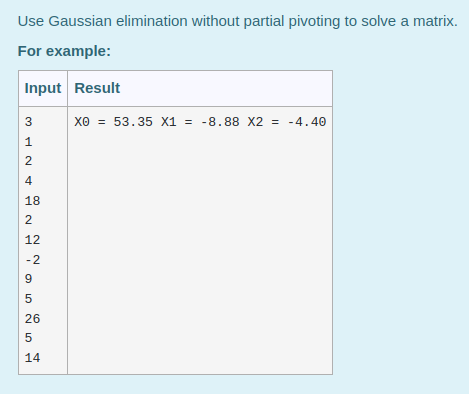
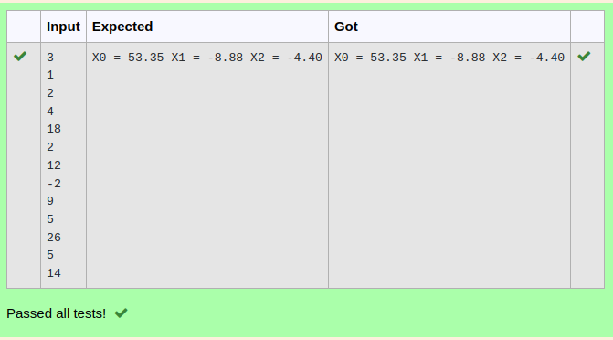

# Gaussian Elimination

## AIM:
To write a program to find the solution of a matrix using Gaussian Elimination.

## Equipments Required:
1. Hardware – PCs
2. Anaconda – Python 3.7 Installation / Moodle-Code Runner

## Algorithm
1. import numpy as np and take input from the user for matrix using nested  for loop
2. convert the given matrix into row-echolon form using nested for loop of i,j and with extra loop in second for loop(j)
3. Then apply row operations using nested loops in a matrix 
4. Then print the values of unknown variable using one for loop 

## Program:
```
/*
Program to find the solution of a matrix using Gaussian Elimination.
Developed by:Shaik Shoaib Nawaz
RegisterNumber:22005600
*/
import numpy as np
n=int(input())
arr=np.zeros((n,n+1))
x=np.zeros(n)
for i in range(n):
    for j in range(n+1):
        arr[i][j]=int(input())
for i in range(n):
    for j in range(i+1,n):
        ratio=arr[j][i]/arr[i][i]
        for k in range(n+1):
            arr[j][k]=arr[j][k]-ratio*arr[i][k]
x[n-1]=arr[n-1][n]/arr[n-1][n-1]
for i in range(n-2,-1,-1):
    x[i]=arr[i][n]
    for j in range(i+1,n):
        x[i]=x[i]-arr[i][j]*x[j]
    x[i]=x[i]/arr[i][i]
for i in range(n):
    print("X%d = %0.2f" %(i,x[i]),end=' ')
```

## Output:
### Question:

### Output:


## Result:
Thus the program to find the solution of a matrix using Gaussian Elimination is written and verified using python programming.

